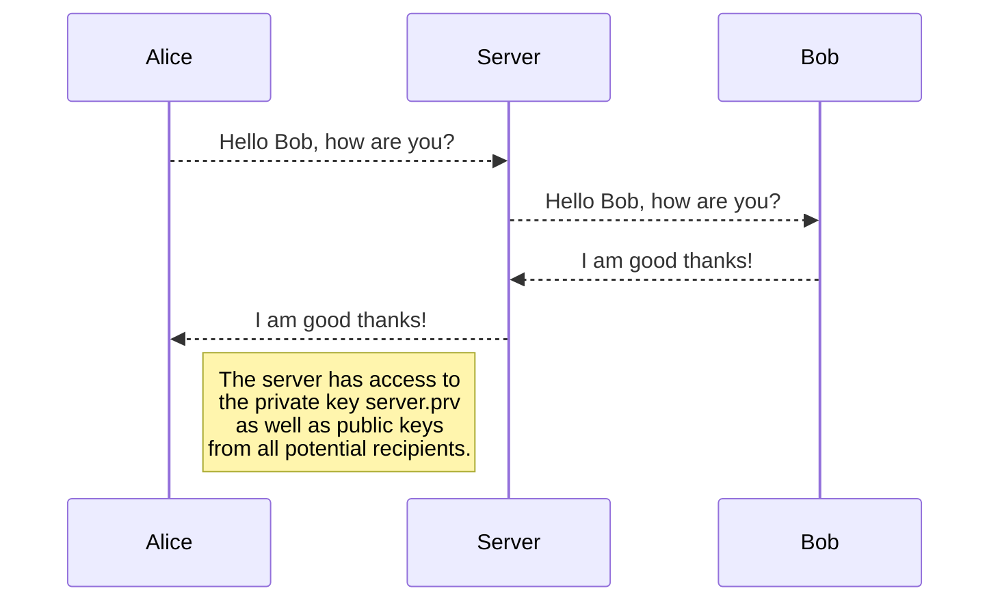
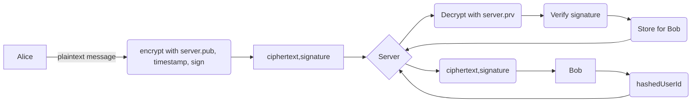

# SilentRelay

SilentRelay is an amateur secure messaging system, implemented in Java. It allows users to send and receive encryted messages securely. This repository contains the source code for both the server and the client components of the system. 

## Table of Contents
- [Installation](##installation)  
- [Usage](##usage)  
- [Architecture](##architecture)  

## Installation
**Prerequisites**
- [Java Development Kit (JDK 17)](https://docs.aws.amazon.com/corretto/latest/corretto-17-ug/downloads-list.html)

**Clone the Repository**
- git clone https://github.com/davidigandan/silentrelay.git

**Generate Cryptographic Keys**

    javac RSAKeyGen.java
    java RSAKeyGen <server>
    java RSAKeyGen <clientID>

**Start the server**

    javac Server.java
    java server <port>

**Start the client**

    javac Client.java
    java client <host> <port> <uuid>
    
   ## Architecture
- The server must be started up first. It listens for an incoming client connection. The server will **NOT** handle multiple client connections
- The server will store (in memory) user messages. Messages will be lost once the program stops. 
- Both the server and the client will verify message signatures, encrypt them and decrypt them as the messages are transmitted. 
- Messages are encrypted using RSA public-key cryptography
- Each message includes a digital signature

## Model of Dataflow

You can render UML diagrams using [Mermaid](https://mermaidjs.github.io/). For example, this will produce a sequence diagram:

### Detailed Flowchart

